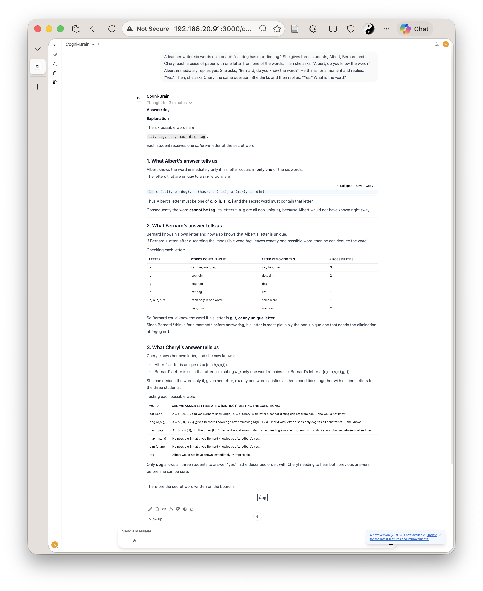
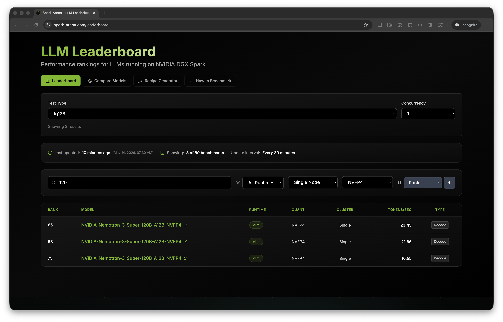

# Running a Real Local AI Agent on DGX Spark · Nemotron-3-Super-120B

I bought a DGX Spark to do real work: running serious local AI agents and training foundation models from scratch — not to run benchmarks.

*(If you are curious about the training side of this hardware, check out [SageGPT](https://github.com/airawatraj/sage-gpt), my 7.5M parameter Sanskrit SLM trained entirely from scratch on this same machine).*

This repo documents what it took to get Nemotron-3-Super-120B actually working
for real agentic tasks: building apps autonomously, solving puzzles, writing code.

The benchmarks are here because community results ranged from 16–19.5 TPS and I
wanted to understand why mine was different. They're a side effect, not the goal.

> ⚠️ **Personal workstation setup. Not for enterprise use. Use at your own risk.**

---

## Real Work — Not Just Benchmarks

### Solving a puzzle the community said no local LLM could crack

I came across a reddit thread that claimed ["There's not a SINGLE local LLM which can solve this logic puzzle"](https://www.reddit.com/r/LocalLLaMA/comments/1mblq5g/theres_not_a_single_local_llm_which_can_solve/) —
only o3 could do it at the time of posting.

Cogni-Brain solved it locally in under 5 minutes via Open WebUI.

<p align="center">
  
  <br><i>Cogni-Brain reasoning through the Albert-Bernard-Cheryl puzzle</i>
</p>

The same prompt on NVIDIA's own cloud-hosted endpoint returned an internal server error:

<p align="center">
  
</p>

### 90 minutes of autonomous agentic work

Cogni-Brain built a complete HTML5 chess app via NemoHermes — pawn promotion,
en passant, castling — running 60 tool-call iterations completely autonomously. The agent successfully navigated proxy timeouts and managed a massive 130K context window without crashing the KV cache. Progress updates were delivered to Telegram throughout.

<p align="center">
  
  <br><i>Mobile progress updates via Telegram during the 60-iteration build</i>
</p>

### Coding agent in VS Code

Cogni-Brain running as a coding agent inside VS Code via Continue extension,
analyzing the vLLM codebase — on the same Spark it is running on.

<p align="center">
  
</p>

### NemoHermes TUI

<p align="center">
  
</p>

---

## Benchmark Results

> NemoHermes agent and Open WebUI were **running alongside** during all benchmark runs.
> TPS includes both reasoning (`<think>`) and answer tokens. Isolated TPS would be higher.

| Metric | Result |
|---|---|
| Single session TPS (average) | **23.2 tok/s** |
| Single session TPS (peak) | **23.6 tok/s** |
| 4 concurrent sessions (total) | **55.3 tok/s** |
| 3 concurrent sessions (total) | **41.7 tok/s** |
| Max context window | **130,753 tokens** |
| TTFT (average) | **212ms** |
| KV cache dtype | FP8 |
| Quantization | NVFP4 (Marlin weight-only) |
| GPU memory utilization | 0.75 |
| Swap during benchmark | 0 bytes |

<p align="center">
  
</p>

<p align="center">
  
</p>

---

## Compared to Prior Published Results

> NemoHermes agent and Open WebUI were **running alongside** during all benchmark runs.
> TPS includes both reasoning (`<think>`) and answer tokens. Isolated TPS would be higher.
>
> **Methodology note:** The [spark-arena leaderboard](https://spark-arena.com/leaderboard) uses a standardised `tg128` test
> (128 fixed output tokens, no production services). This benchmark used 300 output tokens
> with NemoHermes and Open WebUI running alongside. Methodologies are not directly comparable.

| Who | TPS | Stack | Context | Concurrent | Production services |
|---|---|---|---|---|---|
| **Cogni-Brain (airawatraj)** | **23.2** | NVFP4 + vLLM | 131K | 1 | NemoHermes + Open WebUI |
| **Cogni-Brain (airawatraj)** | **55.3** | NVFP4 + vLLM | 131K | 4 | NemoHermes + Open WebUI |
| Seth Hobson (spark-arena, tg128) | 21.66 | NVFP4 + vLLM | 131K | 1 | none |
| Seth Hobson (spark-arena, tg128) | 53.55 | NVFP4 + vLLM | 131K | 5 | none |
| Saiyam Pathak | 19.5 | Q4_K_M GGUF + llama.cpp | 262K | 1 | none |
| Avarok | 19 | NVFP4 + vLLM | unknown | 1 | none |
| Eugr | 16.55 | NVFP4 + vLLM | 256K | unknown | none |
| josephbreda | 16–17 | NVFP4 + vLLM | unknown | 1 | none |

The highest single-node single-session result in the [spark-arena community leaderboard](https://spark-arena.com/leaderboard)
as of May 9, 2026 is 21.66 TPS (tg128, vLLM, NVFP4, Single Node, no production services).
This setup measured 23.2 TPS with NemoHermes and Open WebUI running alongside —
isolated TPS would be higher. Measured with exact `completion_tokens` from vLLM's
streaming usage API. Happy to be proved wrong — let's extract max juice out of Spark.

<p align="center">
  
  <br><i>spark-arena community leaderboard — Single Node, NVFP4, vLLM, concurrency 1 — May 9, 2026</i>
</p>

---

## Hardware & Architecture

- **NVIDIA DGX Spark** (GB10 Grace-Blackwell Superchip)
- **128 GB unified memory** (CPU + GPU shared)
- **Kernel-Level Sandboxing:** The NemoHermes agent stack operates inside an OpenShell environment with K3s, Landlock, and seccomp profiles for isolation during autonomous code generation.
- GPU operating under 75°C throughout

> **Note (Software Limitation):** While the GB10 chip features 5th-gen Tensor Cores capable of FP4, the current vLLM/FlashInfer ecosystem lacks native FP4 MoE kernels for the desktop SM120/SM121 architecture. NVFP4 currently provides weight compression (fitting the model in 128 GB) but forces a fallback to the Marlin dequantization path for compute. See [METHODOLOGY.md](METHODOLOGY.md) for details.

---

## Quick Start

> ⚠️ **Warning:** The setup scripts disable system swap to prevent unified memory thrashing. This is a system-level change.

```bash
# 1. Prerequisites
bash setup/install.sh

# 2. Download reasoning parser
bash setup/download_parser.sh

# 3. Start vLLM
bash docker/start.sh

# 4. Wait for server to be ready (~10 min)
docker logs -f spark-brain | grep "Application startup complete"

# 5. Configure OpenShell Gateway Timeout (Critical for heavy agentic tasks)
openshell inference set -g nemoclaw --provider compatible-endpoint --model Cogni-Brain --timeout 600

# 6. Run benchmark
uv run benchmark/benchmark_spark.py
```

---

## Repository Structure

```text
dgx-spark-nemotron-super-agent/
├── README.md                    ← this file
├── METHODOLOGY.md               ← full measurement methodology
├── CITATION.cff                 ← citation metadata
├── setup/
│   ├── install.sh               ← prerequisites, swap disable
│   └── download_parser.sh       ← fetch super_v3_reasoning_parser.py
├── docker/
│   ├── start.sh                 ← launch vLLM (final production command)
│   ├── stop.sh                  ← stop and remove container
│   └── status.sh                ← health check + memory + VmSwap
├── benchmark/
│   └── benchmark_spark.py       ← TPS, TTFT, context window benchmark
└── assets/                      ← terminal output and real-use images
```

---

## Key Fixes Over Previous Community Setups

| Issue | Old config | Fixed config |
|---|---|---|
| CUDA graphs disabled | `--enforce-eager` | removed |
| Wrong tool parser | `--tool-call-parser hermes` | `qwen3_coder` |
| Marlin backend not set | missing env var | `VLLM_NVFP4_GEMM_BACKEND=marlin` |
| V1 engine disabled | `VLLM_V1_ENABLED=0` | removed |
| FP4 wrong keyword | `--quantization nvfp4` | `fp4` |
| No speculative decoding | missing | MTP `num_speculative_tokens=1` |
| Scheduler throttled | missing flag | `--max-num-batched-tokens 16384` |
| Context mismatch with agent | 65K | 131K (matches NemoHermes config) |

---

## Known Limitations

- Nightly vLLM image — not a stable release
- Uncalibrated FP8 KV cache scaling factors
- Current software stack lacks native FP4 MoE compute kernels for GB10 (SM121), forcing Marlin dequantization fallback
- Single node only (dual-Spark would enable true 1M context)
- Stream stalls under sustained long-running agentic load (NemoHermes retries automatically)

See [METHODOLOGY.md](METHODOLOGY.md) for full details on each limitation.

---

## Feedback Welcome

If you reproduce these results, find errors in the methodology, or achieve higher
numbers — please open an issue or PR. The goal is accurate community benchmarks,
not records.

**Author:** Rajendra Rawat · May 2026